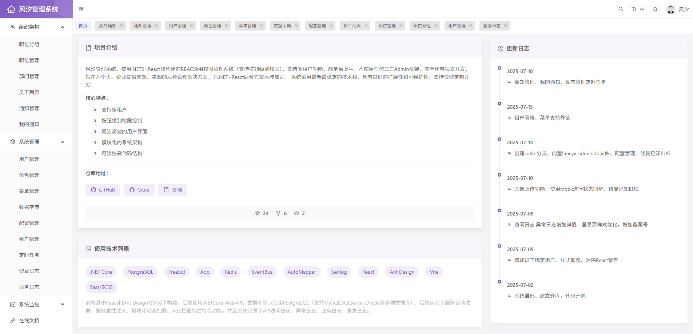
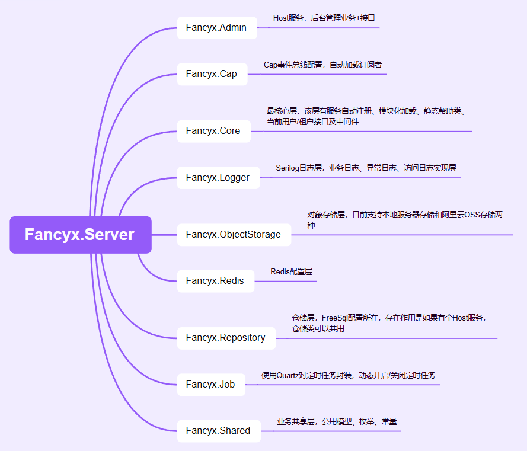
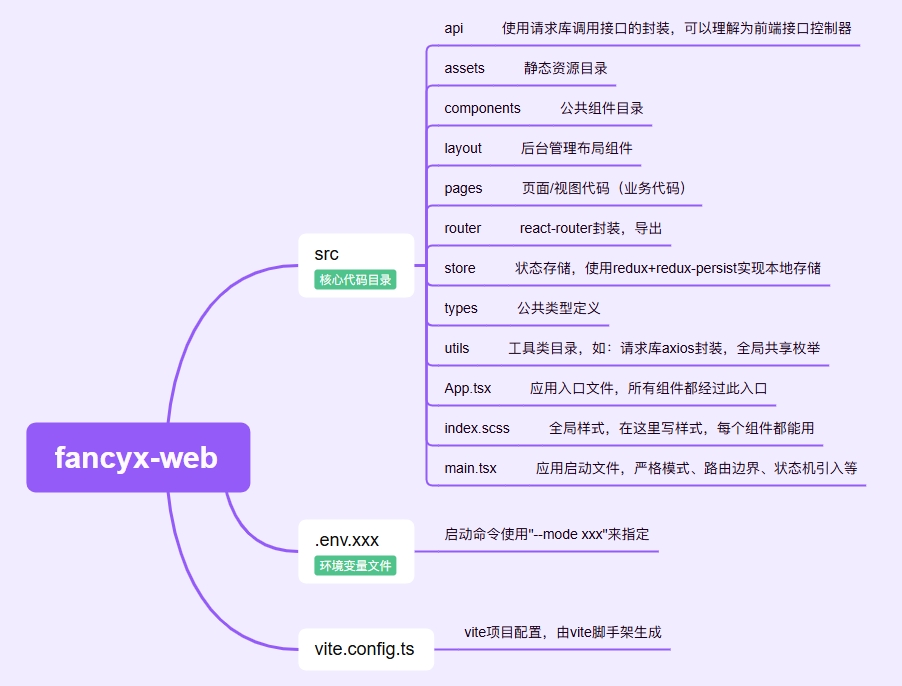

# 风汐管理系统(fancyx-admin)

<!-- PROJECT SHIELDS -->

[](https://github.com/fancyxnet/fancyx-admin)
[](https://github.com/fancyxnet/fancyx-admin)
[](https://github.com/fancyxnet/fancyx-admin)

## 项目介绍

风汐管理系统，适用微服务（Ocelot+Consul）和单体部署；项目使用.NET9+React18构建的RBAC通用权限管理系统（支持按钮级别权限），支持多租户功能，简单易上手，不使用任何三方Admin框架，完全由作者+AI独立开发；旨在为个人、企业提供高效、美观的后台管理解决方案，为.NET+React后台方案添砖加瓦， 系统采用最新最稳定的技术栈，具有良好的扩展性和可维护性，支持快速定制开发。

**核心特点**

* 支持多租户
* 按钮级别权限控制
* 部门级数据权限
* 简洁高效的用户界面
* 模块化的系统架构
* 可读性高代码结构
* 支持微服务和单体

**未来建设**

* 微服务和单体都支持（已实现）
* 持续修复发现BUG
* 持续优化前后端代码
* 增加ERP模块，检测微服务可行性和架构灵活性

## 代码仓库

* GitHub: https://github.com/fancyxnet/fancyx-admin
* Gitee: https://gitee.com/fancyxnet/fancyx-admin

## 在线预览

在线文档： https://doc.crackerwork.cn <br/>
预览地址： https://crackerwork.cn <br/>
预览账号： admin <br/>
预览密码： 123qwe* <br/>

**如果在输入账号和密码后提示错误，请检查账号密码输入框中是否存在空格**

> 注意：预览是演示模式，对于核心数据是无法删除和编辑

## 使用技术

* .NET Core
* PostgreSQL/MySQL
* EFCore
* Aop
* Redis
* EventBus
* AutoMapper
* Autofac
* Castle.Core
* Serilog
* Consul
* Ocelot
* Orleans
* GRPC
* MQTT
* React
* Ant Design
* Vite
* Sass/SCSS

## 功能模块

* 组织架构
  * 职位分组
  * 职位管理
  * 部门管理
  * 通知管理
  * 我的通知
* 系统管理
  * 用户管理
  * 角色管理
  * 菜单管理
  * 数据字典
  * 配置管理
  * 租户管理
  * 登录日志
  * 业务日志
* 系统监控
  * 在线用户
  * 异常日志
  * 访问日志

## 系统截图

1. 登录


2. 首页


## 快速上手

### 项目结构

**后端**



**前端**



### 网关配置文件

网关appsettings.json
```json
{
  "ServiceMode": "Direct", //指定模式
  "CorsOrigins": "http://localhost:8080" //跨域配置
}
```

* `ocelot.consul.json`是`ServiceMode`== "Consul"时使用，表示使用consul服务发现
* `ocelot.direct.json`时`ServiceMode`== "Direct"时使用，表示固定IP和端口直连

### Admin配置文件

```json
{
  //consul连接配置，必须需要配置HttpPort和NodeName，其它可选
  "Consul": {
    "Host": "http://localhost:8500",
    "Token": "99abbc21-ddaf-1cd4-a301-51c0df690841",
    "NodeName": "fancyx-admin-api",
    "HttpPort": 5001, //http端口
    "GrpcPort": 50001 //grpc端口，不需要可以不配置
  },
  "Services": {
    //指定consul模式还是直连模式
    "Mode": "Direct", //Direct or Consul
    "Address": [
      {
        "Name": "fancyx-admin-api",
        "Http": "http://localhost:5001",
        "Grpc": "http://localhost:50001"
      },
      {
        "Name": "fancyx-erp-api",
        "Http": "http://localhost:5002",
        "Grpc": "http://localhost:50002"
      }
    ]
  },
  //是否允许一个用户多处同时登录
  "AccountManyLogin": true,
  "ConnectionStrings": {
    "DbType": "PostgreSql", //指定连接驱动，并且根据驱动读取连接字符串
    "PostgreSql": "Host=localhost;Port=5432;Database=fancyx-admin;User ID=postgres;Password=123456",
    "MySql": "server=127.0.0.1;uid=root;pwd=123456;database=fancyx-admin"
  },
  "Redis": {
    //Redis连接字符串
    "Connection": "127.0.0.1:6379,password=123456"
  },
  "Cap": {
    "TableSchema": "cap", //CAP表前缀或模式
    "RedisConnection": "127.0.0.1:6379,password=123456,defaultDatabase=1" //基于redis传输的CAP
  },
  "Jwt": {
    //JWT误差时间（秒）
    "ClockSkew": 300,
    //JWT发布者
    "ValidAudience": "api",
    //JWT发布者
    "ValidIssuer": "fancyx-admin",
    //JWT签名密钥
    "IssuerSigningKey": "e3b0c44298fc1c149afbf4c8996fb92427ae41e4649b934ca495991b7852b855"
  },
  "Oss": {
    //对象存储路径
    "Bucket": "D:\\Oss",
    //阿里云OSS配置
    "Aliyun": {
      "AccessKey": "", 
      "AccessKeySecret": "",
      "Endpoint": "",
      "Bucket": "",
      "Timeout": 60000,
      "Domain": ""
    }
  },
  "Snowflake": {
    //雪花ID工作ID
    "WorkerId": 1,
    //雪花ID数据中心ID
    "DataCenterId": 4
  },
  "Mqtt": {
    //MQTT服务器暴露端口
    "Port": 1883,
    //MQTT连接账号
    "UserName": "admin",
    //MQTT连接密码
    "Password": "123qwe*"
  }
}
```

### 项目启动

后端项目启动：

* 确认使用Consul服务注册发现还是直连，详见配置：`Services.Mode`
* 修改配置数据库驱动,Redis配置
* 执行根目录下`docs/db/pgsql.sql`或`docs/db/mysql.sql`，会创建表结构，初始化数据
* 修改OSS配置，使用本地目录（盘符一定要有，目录不存在会自动创建）
* 使用VS2022启动网关和你需要的服务（如Fancyx.Admin）

前端项目启动：

* 提前安装`yarn`，运行命令：`npm install -g yarn`
* 安装依赖包，运行命令：`yarn install`
* 开发环境启动，运行命令：`yarn run dev`

## 参与贡献

1. Fork本项目
2. 创建您的特性分支 (git checkout -b feature/AmazingFeature)
3. 提交您的更改 (git commit -m 'Add some AmazingFeature')
4. 推送到分支 (git push origin feature/AmazingFeature)
5. 提交Pull Request

## 许可证

本项目采用[MIT](./LICENSE)开源许可，个人或企业均可免费使用

## 联系方式

* 邮箱：fancyxnet@gmail.com/crackerwork@outlook.com
* QQ：3805712581
* 在线文档： https://doc.crackerwork.cn